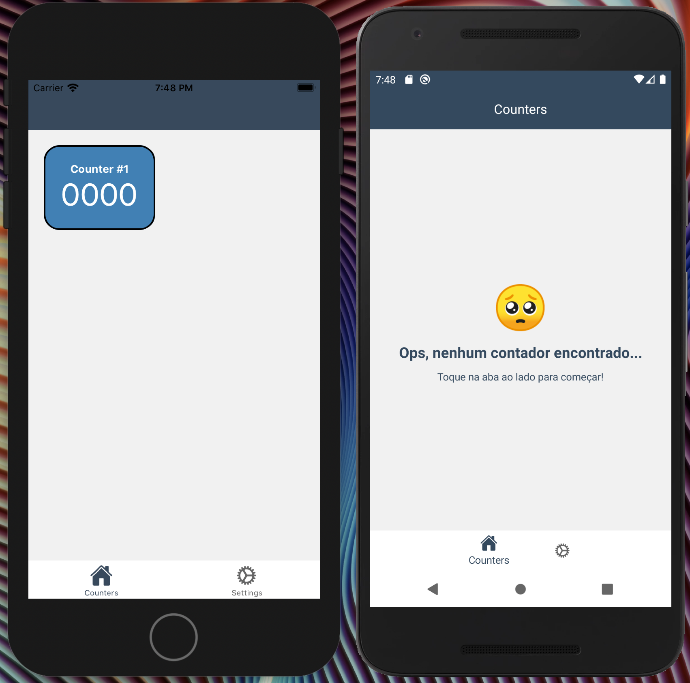

# React-Native Brain  Challenge

## Requisitos: 
- Node 14.x
- [Instalar e configurar React-Native](https://reactnative.dev/docs/environment-setup)
- Xcode atualizado + emuladores/dispositivos
- Android Studio + SDK + Java8 + emuladores/dispositivos

## Instruções
- Clone este repositório: `https://github.com/vedovato/rn-brain-challenge.git`
- Instale dependências do projeto: `npm install`
- Instale dependências do iOS: `cd ios && pod install`
- Inicie o Metro Bundler: `npm start`

## Informações gerais
- Senha da keystore é `vedovato`;
- Para rodar a versão iOS, utilize o arquivo `*.wcworkspace` localizado na pasta `ios` ou o comando `npm run ios` a partir da raiz do projeto, via terminal.

## NPM Scripts
- `npm start`: Inicia o "compilador" do React-Native;
- `npm run android`: Roda a versão debug no Android (dispositivo conectado ou emulador);
- `npm run android:release-build`: Gera versão release do app;
- `npm run android:release-install`: Instala a versão de release no dispositivo/emulador para testes;
- `npm run react-native run-ios`: Roda verão debug no disposito/emulador iOS.

## Requisitos atendidos 🤓
- React 16.11;
- React-Native 0.62:
	- [react-native-navigation](https://wix.github.io/react-native-navigation/);
	- [react-native-vector-icons](https://github.com/oblador/react-native-vector-icons).
- Hooks;
- Redux + Redux Toolkit;
- Feebacks de interação;
- Ícones e botões.

## Requisito não atendidos 😭
- Testes.
